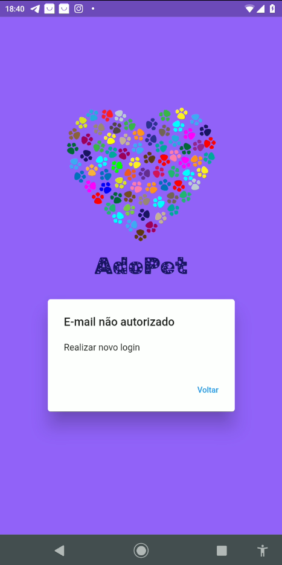
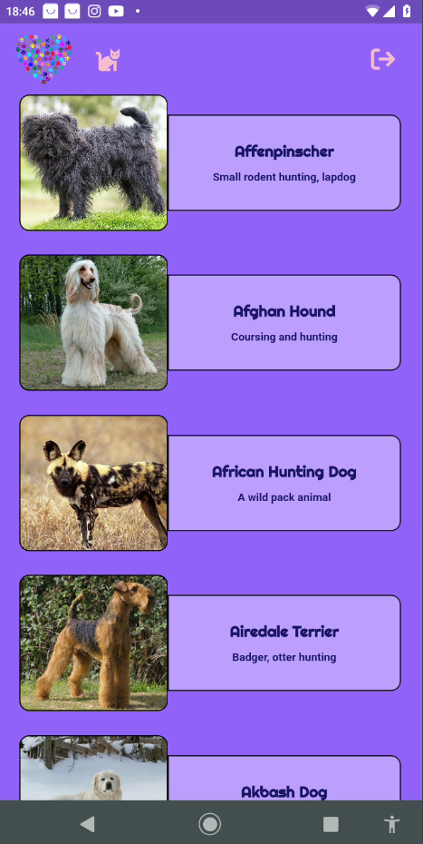
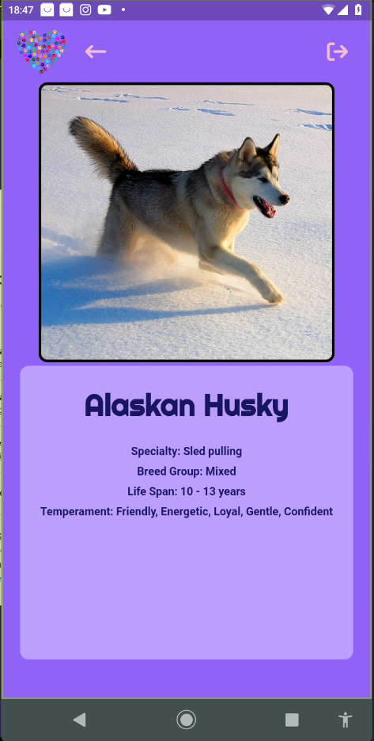
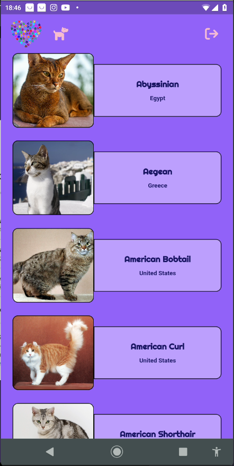
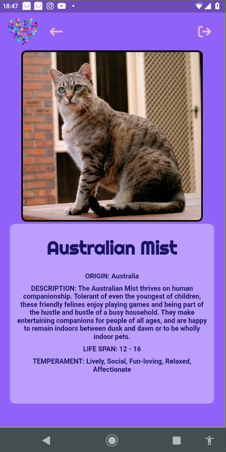

# AdoPet
App para controle de pets para uma ONG de Adoção de Animais.

Projeto consiste em pegar dados das seguintes API's:
 - [API dos cachorro;](https://www.thedogapi.com/)
 - [API dos gatos.](https://thecatapi.com/)


### Segue um gif de como ficou na tela do meu celular
PS: Por ser uma versão de teste é comum ocorrer alguns erros de responsividade.


## Login

O login foi feito por meio do [Firebase](https://firebase.google.com/), sendo necessário uma conta Google para acessar o App, dando assim mais segurança.
Além disso foi realisado um controle de logins, onde só quem tem o e-mail autorizado conseguirá entrar, essa lista de autorizações é dada por meio de um [JSON](https://www.json.org/json-en.html). 

O arquivo com a lista é `users_repository.dart`, está no diretório ```adopet/lib/repositories/users/users_repository.dart```.

### Tela quando há falha de login


### Tela de Home para pesquisar cachorros


### Tela de Informações de um dos cachorros


### Tela de Home para pesquisar gatos


### Tela de Informações de um dos gatos



## Download do apk

Basta ir em `versoes_de_apk`, lá exitem algumas versões para determinadas resoluções. Recomendo usar a versão `app.apk`.


